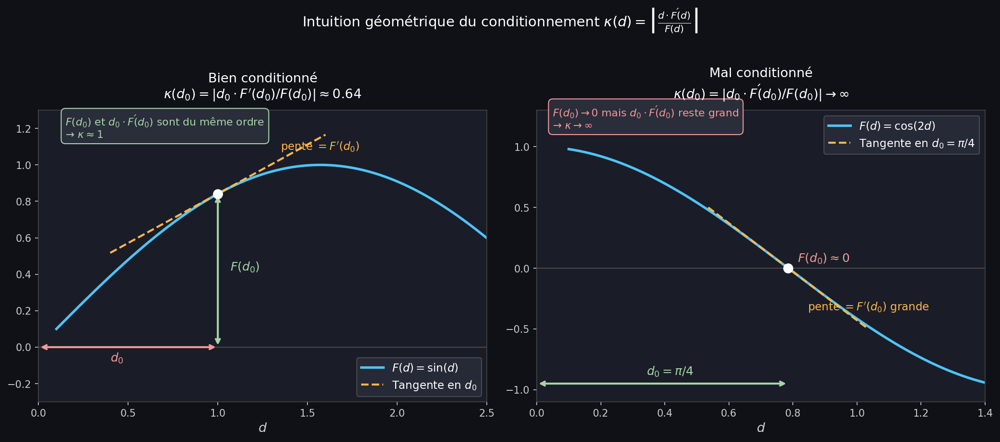

# Exercice 4 — Conditionnement et stabilité d'un algorithme

## 🧱 Brique 1 — Le conditionnement : sensibilité du problème aux données

### L'idée fondamentale

Le **conditionnement** répond à la question :
> *Si mes données d'entrée sont légèrement perturbées (erreur de mesure,
> arrondi...), est-ce que la sortie sera aussi légèrement perturbée,
> ou est-ce que l'erreur va exploser ?*

C'est une propriété du **problème mathématique** lui-même,
indépendamment de comment on le calcule.

### La formule

Pour un problème $x = F(d)$ avec $F$ différentiable :

$$\kappa(d) = \left| \frac{d \cdot F'(d)}{F(d)} \right|$$

C'est le **conditionnement relatif** : il mesure le rapport entre
l'erreur relative sur la sortie et l'erreur relative sur l'entrée.

$$\frac{|\delta x|}{|x|} \leq \kappa(d) \cdot \frac{|\delta d|}{|d|}$$

> 💡 **Interprétation directe :**
> - $\kappa = 1$ → l'erreur relative se transmet telle quelle → **bien conditionné**
> - $\kappa = 100$ → l'erreur relative est multipliée par 100 → **mal conditionné**
> - $\kappa \to \infty$ → même une toute petite erreur d'entrée donne
>   une erreur de sortie arbitrairement grande → **très mal conditionné**

### Cas particuliers importants (du formulaire)

$$d = 0 \implies \kappa(d) = 0 \qquad \text{(parfaitement conditionné)}$$
$$F(d) = 0 \implies \kappa(d) = \infty \qquad \text{(très mal conditionné)}$$

> 💡 **Intuition géométrique :** $\kappa(d) = \left|\frac{\text{pente} \times d}{F(d)}\right|$
> C'est le rapport entre la tangente au graphe et le rapport $F(d)/d$.
> Si la courbe est "presque verticale" en $d$ (pente énorme) ou que $F(d)$
> est très petit → $\kappa$ explose.

## 🧱 Brique 2 — La stabilité : sensibilité de l'algorithme aux arrondis

### La distinction fondamentale

| | Conditionnement | Stabilité |
|---|---|---|
| **Concerne** | Le problème mathématique | L'algorithme de calcul |
| **Question** | La sortie est-elle sensible aux données ? | Les arrondis intermédiaires s'amplifient-ils ? |
| **Remède** | Pas de remède — c'est la nature du problème | Choisir une formule équivalente plus stable |

> 💡 **Analogie :**
> Le conditionnement c'est la météo — tu ne peux pas la changer.
> La stabilité c'est ton imperméable — tu peux choisir d'en avoir un ou pas.

### Comment analyser la stabilité ?

On cherche les **opérations dangereuses** dans l'algorithme :

1. **Soustraction de nombres proches** → erreur d'annulation
   (les chiffres significatifs disparaissent, voir exercice 1).

2. **Ces nombres sont-ils déjà entachés d'erreurs d'arrondi ?**
   Si oui, c'est encore pire : on soustrait deux nombres imprécis
   et proches → catastrophe.

**Règle générale :**
> Une soustraction est d'autant plus dangereuse que les deux opérandes
> sont proches **ET** qu'ils ont été calculés par des étapes précédentes
> (donc déjà entachés d'erreurs).

## 🧱 Brique 3 — Analyse formelle de la stabilité

Pour analyser formellement, on modélise chaque arrondi par un facteur
$(1 + \rho_i)$ avec $|\rho_i| \leq u$ (précision machine).

**Exemple :** Pour $F(d) = a \cdot b$, la machine calcule :

$$\hat{F}(d) = [\hat{a} \cdot \hat{b}](1 + \rho) = a(1+\rho_a) \cdot b(1+\rho_b) \cdot (1+\rho)
\approx F(d)(1 + \rho_a + \rho_b + \rho)$$

L'erreur relative finale est une **somme d'arrondis** → stable.

**Exemple instable :** Pour $F(d) = a - b$ avec $a \approx b$ :

$$\hat{F}(d) = [\hat{a} - \hat{b}](1+\rho) = [a(1+\rho_a) - b(1+\rho_b)](1+\rho)$$

$$= (a - b)(1+\rho) + a\rho_a(1+\rho) - b\rho_b(1+\rho)$$

$$\approx F(d)\left(1 + \rho - \frac{a}{a-b}\rho_a + \frac{b}{a-b}\rho_b\right)$$

Si $a \approx b$, alors $\frac{a}{a-b} \to \infty$ → l'erreur relative explose ! ❌

## 🔧 Recette à l'examen

**Pour le conditionnement :**
1. Calculer $\kappa(d) = \left|\frac{d \cdot F'(d)}{F(d)}\right|$
2. Évaluer en le point demandé (ou étudier la limite)
3. Conclure : $\kappa$ petit → bien conditionné, $\kappa \to \infty$ → mal conditionné

**Pour la stabilité (analyse informelle) :**
1. Identifier toutes les soustractions dans chaque forme
2. Pour chaque soustraction : les opérandes sont-ils proches ?
3. Ces opérandes sont-ils déjà le résultat de calculs précédents (donc déjà imprécis) ?
4. Plus la soustraction dangereuse arrive **tard** avec des opérandes **déjà arrondis**
   → plus c'est instable

**Classement :**
- Forme avec **1 seul arrondi en sortie** → la plus stable
- Forme avec **soustraction de deux calculs arrondis** → la moins stable
- Forme avec **soustraction dont un terme est exact** → intermédiaire

## 🧱 Brique 4 — Quelques rappels des dérivées

| Fonction | Dérivée | Condition |
|---|---|---|
| $k$ (constante) | $0$ |  |
| $ax$ | $a$ |  |
| $\dfrac{1}{x}$ | $-\dfrac{1}{x^2}$ | $x \neq 0$ |
| $x^n$ | $nx^{n-1}$ |  |
| $\dfrac{1}{x^n}$ | $-\dfrac{n}{x^{n+1}}$ | $x \neq 0$ |
| $\sqrt{x}$ | $\dfrac{1}{2\sqrt{x}}$ | $x > 0$ |
| $\sqrt[n]{x}$ | $\dfrac{1}{n\sqrt[n]{x^{n-1}}}$ | $x > 0$ |
| $\sin x$ | $\cos x$ |  |
| $\cos x$ | $-\sin x$ |  |
| $\cos(kx)$ | $-k\sin(kx)$ |  |
| $\tan x$ | $\dfrac{1}{\cos^2 x} = 1 + \tan^2 x$ | $x \neq \dfrac{\pi}{2} + k\pi$ |
| $\ln x$ | $\dfrac{1}{x}$ | $x > 0$ |
| $\log_a x$ | $\dfrac{1}{x\ln a}$ | $x > 0,\ a > 0,\ a \neq 1$ |
| $e^x$ | $e^x$ |  |
| $a^x$ | $a^x \ln a$ | $a > 0,\ a \neq 1$ |

## ✏️ Application — Exercice 4

**Énoncé :** Considérer la fonction $x = \cos(2d)$ autour de $d = \pi/4$.
Est-ce que ce problème est bien conditionné ?
Classer les formes équivalentes ci-dessous par leur stabilité pour $d \approx \pi/4$ :
- $x = \cos(2d)$
- $x = [\cos(d)]^2 - [\sin(d)]^2$
- $x = 1 - 2[\sin(d)]^2$

### Partie 1 : Conditionnement

$$F(d) = \cos(2d) \implies F'(d) = -2\sin(2d)$$

$$\kappa(d) = \left|\frac{d \cdot F'(d)}{F(d)}\right| = \left|\frac{-2d\sin(2d)}{\cos(2d)}\right| = |2d \cdot \tan(2d)|$$

En $d = \pi/4$ :

$$\tan\!\left(2 \cdot \frac{\pi}{4}\right) = \tan\!\left(\frac{\pi}{2}\right) \to \infty$$

$$\implies \kappa\!\left(\frac{\pi}{4}\right) \to \infty$$

Petit rappel: $\tan(x) = \frac{\sin(x)}{\cos(x)}$ et $\cos(\pi/2) = 0$ → $\tan(\pi/2)$ explose.

> **Conclusion :** Le problème est **mal conditionné** autour de $d = \pi/4$.
> Une toute petite erreur sur $d$ provoque une erreur énorme sur $\cos(2d)$.
> Cela s'explique géométriquement : $\cos$ passe par zéro en $\pi/2 = 2 \times \pi/4$,
> et $F(d) \to 0$ fait exploser $\kappa$.

### Partie 2 : Stabilité des trois formes

**Observation clé :** Pour $d \approx \pi/4$, on a
$\cos(d) \approx \sin(d) \approx \frac{1}{\sqrt{2}} \approx 0.707$,
donc $\cos^2(d) \approx \sin^2(d) \approx 0.5$.

**Forme A : $\cos(2d)$** ✅ La plus stable

Le seul arrondi est celui appliqué **à la sortie** de la fonction $\cos$ :

$$\hat{x} = \cos(2d)(1 + \rho)$$

L'erreur relative est simplement $\rho$ — un seul arrondi, pas d'amplification.

**Forme B : $[\cos(d)]^2 - [\sin(d)]^2$** ❌ La moins stable

Les étapes sont : calculer $\cos(d)$, le mettre au carré, calculer $\sin(d)$,
le mettre au carré, puis **soustraire**.

Or $\cos^2(d) \approx \sin^2(d) \approx 0.5$ → on **soustrait deux nombres proches**.
Ces deux nombres ont chacun été arrondis lors de leurs calculs respectifs.
On soustrait donc deux valeurs **déjà imprécises et proches** → annulation maximale.

**Forme C : $1 - 2[\sin(d)]^2$** ⚠️ Intermédiaire

Il y a aussi une soustraction de deux nombres proches
($1 \approx 2\sin^2(\pi/4) = 2 \times 0.5 = 1$... résultat $\approx 0$).

Mais **le 1 est exact** — il n'est pas le résultat d'un calcul précédent.
Seul $2\sin^2(d)$ est entaché d'erreurs. C'est donc moins grave que la forme B.

### Classement final

| Forme | Opération dangereuse | Stabilité |
|---|---|---|
| $\cos(2d)$ | Aucune | ✅ La plus stable |
| $1 - 2\sin^2(d)$ | Soustraction, mais 1 est exact | ⚠️ Intermédiaire |
| $\cos^2(d) - \sin^2(d)$ | Soustraction de deux termes arrondis | ❌ La moins stable |

### Réponse à écrire à l'exam :
> Le conditionnement $\kappa(d) = |2d\tan(2d)| \to \infty$ pour $d \to \pi/4$,
> donc le problème est **mal conditionné**. Pour la stabilité : $\cos(2d)$
> est la plus stable (un seul arrondi en sortie). $\cos^2(d) - \sin^2(d)$
> est la moins stable (soustraction de deux termes proches déjà arrondis).
> $1 - 2\sin^2(d)$ est intermédiaire (soustraction mais le 1 est exact).