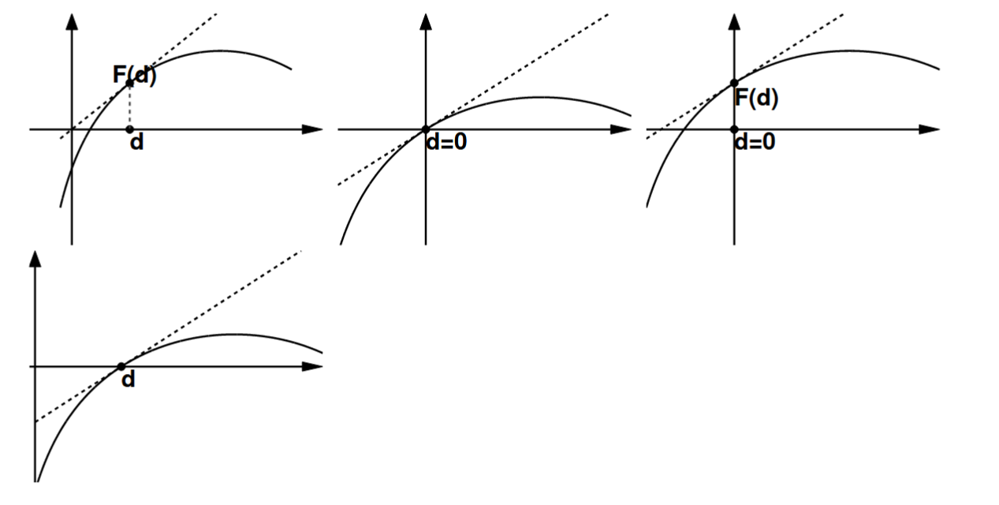

# Exercice 5 — Lire le conditionnement sur un graphique

## 🧱 Brique 1 — Rappel : la formule du conditionnement

$$\kappa(d) = \left| \frac{d \cdot F'(d)}{F(d)} \right|$$

Sur un graphique, on a accès à trois choses :
- $d$ → la position du point sur l'axe horizontal
- $F(d)$ → la hauteur de la courbe en ce point
- $F'(d)$ → la **pente de la tangente** (les tirets sur le graphique)

## 🧱 Brique 2 — Les quatre règles graphiques

### Règle 1 — $d = 0$ et $F(0) \neq 0$ → $\kappa = 0$

$$\kappa(0) = \left|\frac{0 \cdot F'(0)}{F(0)}\right| = 0$$

Le numérateur est nul car $d = 0$, peu importe la pente.

> 💡 **Astuce visuelle :** Le point est sur **l'axe vertical** ($d = 0$)
> et la courbe ne passe pas par zéro → $\kappa = 0$ immédiatement.

### Règle 2 — La tangente passe par l'origine → $\kappa = 1$

Si la droite tangente en $d$ passe par le point $(0, 0)$, sa pente vaut :

$$F'(d) = \frac{F(d) - 0}{d - 0} = \frac{F(d)}{d}$$

$$\implies \kappa(d) = \left|\frac{d \cdot \frac{F(d)}{d}}{F(d)}\right| = 1$$

> 💡 **Astuce visuelle :** Trace mentalement une droite de l'origine jusqu'au
> point de tangence. Si elle coïncide avec la tangente tracée → $\kappa = 1$.

### Règle 3 — $d = 0$ et $F(0) = 0$ → calculer la limite → $\kappa = 1$

Quand $d = 0$ et $F(0) = 0$, la formule directe donne $\frac{0}{0}$, une
forme indéterminée. On calcule la limite par Taylor :

$$\kappa(0) = \lim_{d \to 0} \left|\frac{d \cdot F'(d)}{F(d)}\right|$$

Si $F$ est différentiable avec $F'(0) \neq 0$, par développement de Taylor :
$F(d) \approx F'(0) \cdot d$, donc :

$$\kappa(0) = \lim_{d \to 0} \left|\frac{d \cdot F'(0)}{F'(0) \cdot d}\right| = 1$$

> 💡 **Astuce visuelle :** Le point est à l'origine $(0, 0)$ et la tangente
> passe aussi par l'origine → $\kappa = 1$.

### Règle 4 — $F(d) = 0$ avec $d \neq 0$ → $\kappa = \infty$

$$F(d) = 0 \implies \kappa(d) = \left|\frac{d \cdot F'(d)}{0}\right| = \infty$$

> 💡 **Astuce visuelle :** Le point de tangence est **sur l'axe horizontal**
> ($F(d) = 0$) mais $d \neq 0$ → $\kappa \to \infty$, peu importe la pente.

## 🔧 Recette à l'examen

Face à un graphique avec une tangente tracée en $d$ :

1. **$d = 0$ et $F(d) \neq 0$ ?** → $\kappa = 0$ ✅ bon
2. **$F(d) = 0$ et $d \neq 0$ ?** → $\kappa = \infty$ ❌ mauvais
3. **$d = 0$ et $F(0) = 0$ (point à l'origine) ?** → $\kappa = 1$ ✅ bon
4. **La tangente passe par l'origine ?** → $\kappa = 1$ ✅ bon
5. **Aucun des cas ci-dessus ?** → calculer $\kappa = |d \cdot F'(d) / F(d)|$
   en lisant les valeurs sur le graphique

## ✏️ Application — Exercice 5

**Énoncé :** Est-ce que l'évaluation $F(d)$ est bien conditionnée pour les points $d$
et les fonctions $F(d)$ dans les quatre graphiques ? Choisir parmi :
(a) bon, (b) mauvais, (c) impossible à conclure.
Les tirets représentent la tangente au graphe de $F(d)$ en $d$.

### Graphique 1 — haut gauche

**Observation :** $d > 0$, $F(d) > 0$, et la tangente (tirets) passe visuellement
**par l'origine** → on est dans le cas de la Règle 2.

$$\kappa(d) = 1 \implies \textbf{(a) Bien conditionné}$$

### Graphique 2 — haut milieu

**Observation :** $d = 0$, la courbe passe par l'origine donc $F(0) = 0$,
et la tangente passe aussi par l'origine → Règle 3 (forme indéterminée $0/0$,
résolue par Taylor).

$$\kappa(0) = \lim_{d \to 0} \left|\frac{d \cdot F'(d)}{F(d)}\right| = 1
\implies \textbf{(a) Bien conditionné}$$

### Graphique 3 — haut droite

**Observation :** $d = 0$, mais $F(0) > 0$ (la courbe ne passe pas par zéro)
→ Règle 1. Le numérateur $d \cdot F'(d) = 0$ quel que soit $F'(0)$.

$$\kappa(0) = \left|\frac{0 \cdot F'(0)}{F(0)}\right| = 0
\implies \textbf{(a) Bien conditionné}$$

### Graphique 4 — bas gauche

**Observation :** $d > 0$, mais le point est **sur l'axe horizontal**,
donc $F(d) = 0$ → Règle 4. Le dénominateur est nul.

$$\kappa(d) = \left|\frac{d \cdot F'(d)}{0}\right| \to \infty
\implies \textbf{(b) Mal conditionné}$$

### Tableau récapitulatif

| Graphique | $d$ | $F(d)$ | Tangente | $\kappa$ | Conclusion |
|---|---|---|---|---|---|
| Haut gauche | $d > 0$ | $F(d) > 0$ | Passe par l'origine | $1$ | ✅ Bon |
| Haut milieu | $d = 0$ | $F(0) = 0$ | Passe par l'origine | $1$ | ✅ Bon |
| Haut droite | $d = 0$ | $F(0) > 0$ | Quelconque | $0$ | ✅ Bon |
| Bas gauche | $d > 0$ | $F(d) = 0$ | Quelconque | $\infty$ | ❌ Mauvais |

### Réponse à écrire à l'exam :
> - Graphique 1 : tangente passe par l'origine → $\kappa = 1$, bon conditionné.
> - Graphique 2 : $d=0$ et $F(0)=0$, limite par Taylor → $\kappa = 1$, bon conditionné.
> - Graphique 3 : $d=0$ et $F(0) \neq 0$ → $\kappa = 0$, bon conditionné.
> - Graphique 4 : $F(d)=0$ et $d \neq 0$ → $\kappa = \infty$, mal conditionné.