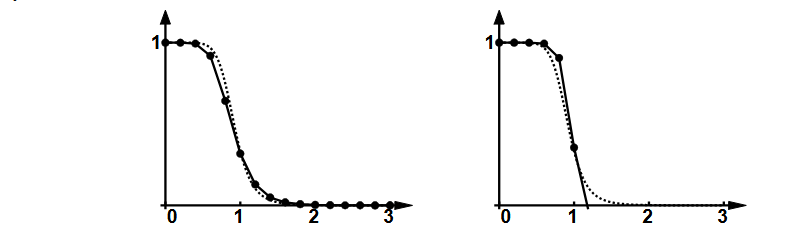

# 📘 Fiche d'étude — Exercice 16 : EDO

## Euler implicite — résolution d'une équation quadratique + stabilité

---

## 🧠 Théorie nouvelle à comprendre

### Stabilité d'une méthode numérique — c'est quoi ?

**Définition simple :** une méthode est **stable** si les erreurs commises à chaque pas ne s'accumulent pas et ne grossissent pas sans contrôle au fil des itérations.

> 💡 **Analogie :** Tu conduis sur une route sinueuse. Une méthode stable, c'est comme un volant réactif — si tu fais un petit écart, tu te redresses. Une méthode instable, c'est comme des roues qui vibrent — un tout petit choc et la voiture part dans tous les sens.

---

### Euler explicite vs implicite — différence de stabilité

C'est **la** grande différence entre les deux méthodes :

| | Euler explicite | Euler implicite |
|---|---|---|
| **Calcul** | Simple (direct) | Plus compliqué (résoudre une équation) |
| **Stabilité** | Conditionnelle : stable **seulement si $h$ est assez petit** | **Absolument stable** : stable pour **tout $h$** |

**Euler implicite est absolument stable** : peu importe la taille du pas $h$, les erreurs ne s'emballent pas. C'est son grand avantage — on paie avec un calcul plus complexe à chaque pas.

---

### Comment résoudre l'Euler implicite quand ça donne une équation quadratique ?

L'Euler implicite donne $\hat{y}_{n+1}$ des deux côtés. Si $f$ contient $y^2$, en développant on obtient une équation quadratique en $\hat{y}_{n+1}$. On la résout avec la **formule quadratique** :

Pour $ax^2 + bx + c = 0$ :
$$x = \frac{-b \pm \sqrt{b^2 - 4ac}}{2a}$$

> 💡 **Laquelle des deux racines prendre ($+$ ou $-$) ?** On prend celle qui est **proche de $\hat{y}_n$** (la valeur du pas précédent). En général, l'énoncé indique laquelle (ou on vérifie les deux et on garde la cohérente).

---

## 🔢 L'exercice 16 — Énoncé

> Considérer l'EDO $y'(t) = r\lambda t^{r-1}[y(t)]^2$ avec la condition initiale $y(0) = y_0$.
>
> **(a)** Vérifier que $y(t) = \dfrac{y_0}{1 - y_0 \lambda t^r}$ est une solution.
>
> **(b)** La solution est-elle unique ? Pourquoi (pas) ?
>
> **(c)** Montrer que l'itération d'Euler implicite est donnée par :
> $$\hat{y}(t+h) = \frac{1 - \sqrt{1 - 4hr\lambda(t+h)^{r-1}\hat{y}(t)}}{2hr\lambda(t+h)^{r-1}}$$
>
> **(d)** Les deux graphiques ci-dessous montrent les résultats pour $\lambda = -2$, $r = 8$, $y_0 = 1$ avec $h = 0{,}2$. La courbe en tirets est la vraie solution, la courbe en points est la méthode numérique. Identifier lequel correspond à la méthode implicite (gauche ou droite) et nommer le bénéfice.

---

## 🧩 Résolution complète — étape par étape

---

### Partie (a) — Vérifier que $y(t) = \dfrac{y_0}{1 - y_0 \lambda t^r}$ est solution

**Étape 0 — Identifier $f(t, y)$**

$$f(t, y) = r\lambda t^{r-1} y^2$$

**Étape 1 — Calculer $y'(t)$ avec la règle du quotient**

On a $y(t) = \dfrac{y_0}{1 - y_0 \lambda t^r}$. C'est un quotient $\dfrac{u}{v}$, avec :

- $u = y_0$ (constante) → $u' = 0$
- $v = 1 - y_0 \lambda t^r$ → $v' = -y_0 \lambda r t^{r-1}$

On applique : $\left(\dfrac{u}{v}\right)' = \dfrac{u'v - uv'}{v^2}$

$$y'(t) = \frac{0 \cdot (1 - y_0\lambda t^r) - y_0 \cdot (-y_0\lambda r t^{r-1})}{(1 - y_0\lambda t^r)^2} = \frac{y_0^2 \lambda r t^{r-1}}{(1 - y_0\lambda t^r)^2}$$

**Étape 2 — Calculer $f(t, y(t)) = r\lambda t^{r-1}[y(t)]^2$**

$$[y(t)]^2 = \frac{y_0^2}{(1-y_0\lambda t^r)^2}$$

$$f(t, y(t)) = r\lambda t^{r-1} \cdot \frac{y_0^2}{(1-y_0\lambda t^r)^2} = \frac{y_0^2 \lambda r t^{r-1}}{(1-y_0\lambda t^r)^2}$$

**Étape 3 — Comparer**

$$y'(t) = \frac{y_0^2 \lambda r t^{r-1}}{(1-y_0\lambda t^r)^2} = f(t, y(t)) \quad \checkmark \; ✅$$

**Étape 4 — Vérifier la condition initiale**

$$y(0) = \frac{y_0}{1 - y_0 \lambda \cdot 0^r} = \frac{y_0}{1 - 0} = y_0 \quad \checkmark \; ✅$$

---

### Partie (b) — Unicité de la solution

**Étape 1 — Calculer $\dfrac{\partial f}{\partial y}$**

$$f(t, y) = r\lambda t^{r-1} y^2$$

$$\frac{\partial f}{\partial y} = r\lambda t^{r-1} \cdot 2y = 2r\lambda t^{r-1} y$$

**Étape 2 — Vérifier si c'est borné**

$$\left|\frac{\partial f}{\partial y}\right| = 2|r\lambda t^{r-1} y|$$

Cette expression est bornée pour tout $y$ fini — il n'y a **pas de division par $y$**, pas de racine carrée, rien qui puisse exploser en $y = 0$.

**Conclusion :** Lipschitz est satisfaite pour **tout $y$** → la solution est **unique** ✅.

> 💡 Contraste avec les exos 14 et 15 : ici $f \propto y^2$ (pas $\frac{1}{y}$ ni $\frac{1}{\sqrt{y}}$), donc il n'y a pas de problème en $y = 0$.

---

### Partie (c) — Développer l'Euler implicite et résoudre l'équation quadratique

**Étape 1 — Écrire la formule d'Euler implicite générale**

$$\hat{y}(t+h) = \hat{y}(t) + h \cdot f(t+h,\ \hat{y}(t+h))$$

**Étape 2 — Remplacer $f$**

Avec $f(t, y) = r\lambda t^{r-1} y^2$, on évalue en $t+h$ et $\hat{y}(t+h)$ :

$$\hat{y}(t+h) = \hat{y}(t) + h \cdot r\lambda(t+h)^{r-1} \cdot [\hat{y}(t+h)]^2$$

> 💡 Pour alléger l'écriture, on pose $\alpha = hr\lambda(t+h)^{r-1}$ (c'est juste un nom pour regrouper tout ce qui ne contient pas $\hat{y}(t+h)$). Cela donne :

$$\hat{y}(t+h) = \hat{y}(t) + \alpha \cdot [\hat{y}(t+h)]^2$$

**Étape 3 — Reformuler en équation quadratique**

On veut une équation de la forme $ax^2 + bx + c = 0$. Posons $x = \hat{y}(t+h)$ pour simplifier la notation. L'équation devient :

$$x = \hat{y}(t) + \alpha x^2$$

On déplace tout du même côté :

$$\alpha x^2 - x + \hat{y}(t) = 0$$

C'est une équation quadratique en $x$ avec :
- $a = \alpha = hr\lambda(t+h)^{r-1}$
- $b = -1$
- $c = \hat{y}(t)$

**Étape 4 — Appliquer la formule quadratique**

$$x = \frac{-b \pm \sqrt{b^2 - 4ac}}{2a} = \frac{-(-1) \pm \sqrt{(-1)^2 - 4 \cdot \alpha \cdot \hat{y}(t)}}{2\alpha}$$

$$x = \frac{1 \pm \sqrt{1 - 4\alpha\hat{y}(t)}}{2\alpha}$$

En remettant $\alpha = hr\lambda(t+h)^{r-1}$ :

$$\hat{y}(t+h) = \frac{1 \pm \sqrt{1 - 4hr\lambda(t+h)^{r-1}\hat{y}(t)}}{2hr\lambda(t+h)^{r-1}}$$

**Étape 5 — Choisir la bonne racine ($+$ ou $-$) ?**

On prend le signe $-$ (la racine avec le $-$ devant la racine carrée). Pourquoi ? Parce que quand $h \to 0$, on doit retrouver $\hat{y}(t+h) \to \hat{y}(t)$. Vérifions rapidement :

Quand $h \to 0$, $\alpha \to 0$, et $\sqrt{1 - 4\alpha\hat{y}(t)} \approx 1 - 2\alpha\hat{y}(t)$ (développement au premier ordre). Donc :

- Avec $-$ : $\dfrac{1 - (1 - 2\alpha\hat{y}(t))}{2\alpha} = \dfrac{2\alpha\hat{y}(t)}{2\alpha} = \hat{y}(t)$ ✅
- Avec $+$ : $\dfrac{1 + (1 - 2\alpha\hat{y}(t))}{2\alpha} = \dfrac{2 - 2\alpha\hat{y}(t)}{2\alpha} \to \infty$ ❌

On prend donc le signe $-$ :

$$\boxed{\hat{y}(t+h) = \frac{1 - \sqrt{1 - 4hr\lambda(t+h)^{r-1}\hat{y}(t)}}{2hr\lambda(t+h)^{r-1}}}$$

---

### Partie (d) — Interpréter les graphiques

**Ce que montrent les graphiques :**

- La **courbe en tirets** = la vraie solution analytique $y(t)$
- Les **points reliés** = l'approximation numérique avec $h = 0{,}2$

**Graphique de gauche :**

La courbe numérique (points) suit très fidèlement la vraie solution (tirets) jusqu'à $t = 3$. La méthode reste stable tout au long.

→ **C'est Euler implicite (rétrograde)** ✅

**Graphique de droite :**

La courbe numérique diverge de la vraie solution autour de $t = 1$. Elle chute brusquement, décroche de la vraie solution et s'arrête avant $t = 2$.

→ **C'est Euler explicite (progressif)** ❌

**Le bénéfice nommé : stabilité absolue**

Euler implicite est **absolument stable** — pour $h = 0{,}2$, il reste stable et donne une bonne approximation.

Euler explicite est instable pour ce même $h = 0{,}2$ — le pas est trop grand et la méthode diverge. Il faudrait prendre un $h$ beaucoup plus petit pour stabiliser Euler explicite.

> 💡 **En résumé :** Pour ce problème avec $h = 0{,}2$, Euler explicite "n'est pas capable de suivre la courbe" et part dans le mauvais sens, alors qu'Euler implicite s'en sort parfaitement — au prix d'un calcul plus compliqué à chaque pas (résoudre une équation quadratique).

---

## 🍳 La recette / le modèle à retenir

### Pour vérifier une solution $y(t) = u(t)/v(t)$ (quotient) :
1. Calculer $y'(t)$ avec la règle du quotient : $\frac{u'v - uv'}{v^2}$
2. Calculer $[y(t)]^2$ (souvent utile quand $f$ contient $y^2$)
3. Vérifier que $y'(t) = f(t, y(t))$ et que $y(t_0) = y_0$

### Pour Euler implicite → équation quadratique :
1. Écrire : $\hat{y}_{n+1} = \hat{y}_n + h \cdot f(t_{n+1}, \hat{y}_{n+1})$
2. Remplacer $f$ → faire apparaître $[\hat{y}_{n+1}]^2$ des deux côtés
3. Déplacer tout d'un côté → forme $a[\hat{y}_{n+1}]^2 + b\hat{y}_{n+1} + c = 0$
4. Appliquer la formule quadratique
5. Choisir la racine qui donne $\hat{y}_{n+1} \to \hat{y}_n$ quand $h \to 0$

### Pour interpréter les graphiques stabilité :
- Méthode qui **suit** la vraie solution → **implicite** (absolument stable)
- Méthode qui **décroche** / **diverge** → **explicite** (instable si $h$ trop grand)

---

## ⚠️ Ce que tu dois savoir par cœur

**Formule quadratique** (indispensable ici) :
$$ax^2 + bx + c = 0 \implies x = \frac{-b \pm \sqrt{b^2 - 4ac}}{2a}$$

**La règle d'or stabilité :**
- Euler **explicite** : stable seulement si $h$ **suffisamment petit**
- Euler **implicite** : **absolument stable** (pour tout $h$)

**Règle du quotient** (dérivation) :
$$\left(\frac{u}{v}\right)' = \frac{u'v - uv'}{v^2}$$

---

*Fiche préparée pour l'examen INFO-F-205 — Exercice 16 (chapitre EDO)*